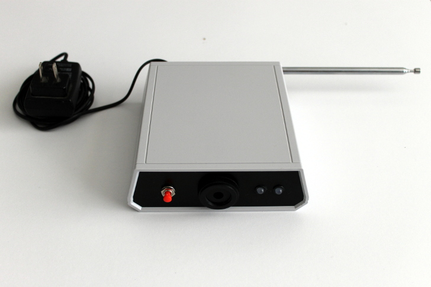
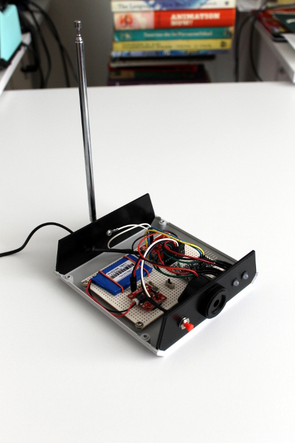
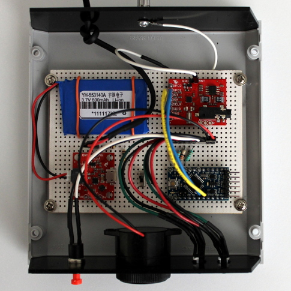
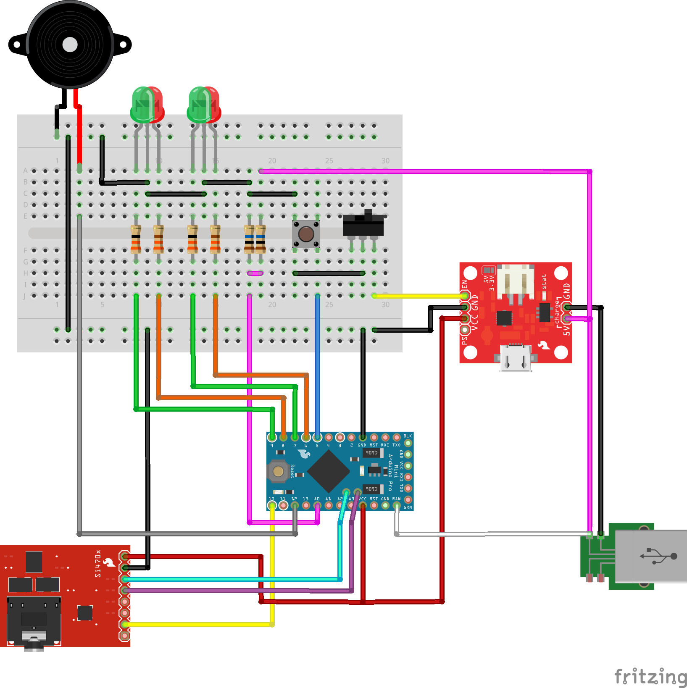
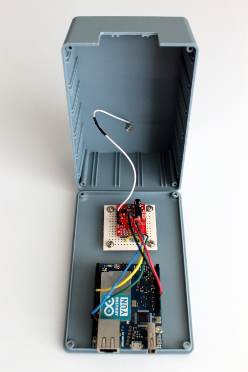

Sismo Alerta
============

Receptor libre de la señal pública del [Sistema de Alerta Sísmica
Mexicano](http://www.cires.org.mx/sasmex_es.php).

Sismo Alerta emite un fuerte sonido y parpadea sus leds en caso de
recibir la alerta sísmica. Incluye batería de respaldo para no depender
de la energía de la red eléctrica.

Prototipo
---------

[](https://flic.kr/p/qupofe)

[](https://flic.kr/p/pPRnoG)

[](https://flic.kr/p/qwKxXX)

Operación
---------

La interacción con el usuario es por medio de:

- Led bicolor (rojo y verde) marcado como _energía_.
- Led bicolor (rojo y verde) marcado como _señal_.
- Zumbador.
- Botón de usuario.

Al encender Sismo Alerta realiza una autoprueba que consiste en:

1. Encender ambos leds en color verde y activar el zumbador
2. Encender ambos leds en color rojo y desactivar el zumbador
3. Apagar ambos leds

Si después de la autoprueba se enciende el led de energía en color rojo
existe un problema interno.

Después de la autoprueba Sismo Alerta buscara el canal con mejor calidad
para monitorear la alerta sísmica. En caso de no encontrar un canal se
encenderá el led de señal en color rojo.

En caso de sintonizar un canal con éxito el led de señal encenderá
intermitentemente en color verde. Cuando Sismo Alerta reciba la prueba
periódica del Sistema de Alerta Sísmica el led de señal dejara de
parpadear y quedara encendido en color verde. El mensaje de prueba se
transmite cada 3 horas a partir de las 2:45.

En caso de recibir un mensaje de alerta sísmica ambos leds encenderán
intermitentemente en color rojo y el zumbador se activara. La duración
de la alerta es de 60 segundos.

Para probar Sismo Alerta basta con presionar el botón de usuario durante
al menos 3 segundos y se activara la alerta sísmica durante 10 segundos.

En resumen, los leds indican:

Led|Color|Significado
---|-----|-----------
Energía y Señal|Intermitente Rojo|Alerta sísmica
Señal|Apagado|Sintonizando canal por primera vez
Señal|Intermitente Verde|Canal sintonizado, esperando prueba periódica
Señal|Verde|Canal sintonizado y prueba periódica vigente
Señal|Rojo|No se pudo sintonizar un canal
Energía|Apagado|Apagada, batería de respaldo agotada
Energía|Verde|Alimentada por la red eléctrica
Energía|Intermitente Verde|Alimentada por la batería de respaldo
Energía|Rojo|Problema interno de hardware

Funcionamiento
--------------

Sismo Alerta es posible gracias a la señal publica del Sistema de Alerta
Sísmica Mexicano operado por el [Centro de Instrumentación y Registro
Sísmico](http://www.cires.org.mx/).

La señal del Sistema de Alerta Sísmica Mexicano es de tipo
[VHF](http://en.wikipedia.org/wiki/Very_high_frequency) en los canales
de [Weather Radio](http://en.wikipedia.org/wiki/Weather_radio) y utiliza
el [protocolo
SAME](http://en.wikipedia.org/wiki/Specific_Area_Message_Encoding) para
transmitir alertas sobre distintos riesgos.

Sismo Alerta sintoniza y decodifica esta señal gracias al chip
[Si4707](http://www.silabs.com/products/audio/fm-am-receiver/pages/si4707.aspx)
que junto a una placa [Arduino](http://arduino.cc) dispara la alerta
sísmica de acuerdo al mensaje recibido.

Hardware
--------

### Lista de partes

Cantidad | Descripción
-------- | -----------
1 | [Arduino Pro Mini 3.3 V @ 8 Mhz](http://arduino.cc/en/Main/ArduinoBoardProMini)
1 | [Power Cell: LiPo Charger/Booster](https://www.sparkfun.com/products/11231) **
1 | [Si4707 Weather Band Receiver Breakout](https://www.sparkfun.com/products/11129)
1 | Batería Li-Ion 3.7 V @ 800 mAh conector JST **
2 | Led Bicolor 5 mm rojo/verde catodo común
2 | Resistencia 33 Ω 1/4 W
2 | Resistencia 330 Ω 1/4 W
2 | Resistencia 10M Ω 1/4 W
1 | Antena monopolo
1 | Zumbador
1 | Botón pulsador normalmente abierto
1 | Swtich 1 polo 2 tiros 2 posiciones **
1 | Conector USB tipo B hembra
1 | Convertidor AC a DC 5 V @ 500 mA conector USB tipo B macho

** Versión con batería de respaldo

#### Antena monopolo

Por la frecuencia de la señal pública del Sistema de Alerta Sísmico
Mexicano es muy fácil construir o adaptar una antena que nos permita
sintonizarla, hay dos opciones:

1. Tramo de 45 cm de cable.
2. Un elemento de una _antena de conejo_.

#### Importante

- Configurar la Power Cell a 3.3 V (cortar jumper 5V y soldar 3.3V).
- Configurar Si4707 Breakout para usar una antena externa (cortar jumper
  HP y soldar EXT).

### Esquema de conexiones



- La conexión blanca (abajo derecha) se debe hacer solo en caso de la
  versión sin batería de respaldo y Power Cell.

- No se muestra la antena que debe ir conectada al pin ANT de la Si4707
  Weather Band Receiver Breakout ni la batería que debe ir al conector
  JST de la Power Cell.

Firmware
--------

Para Arduino IDE 1.5.7 y requiere las siguientes bibliotecas:

- [Si4707 Arduino Library](https://github.com/manuel-rabade/Si4707_Arduino_Library)
- [TimerOne Library](https://github.com/PaulStoffregen/TimerOne)

La estructura de [SismoAlerta.ino](firmware/SismoAlerta/SismoAlerta.ino)
es:

- Una maquina de estados en el ciclo infinito del sketch encargada
  escaneo de canales y monitoreo de mensajes.
- Una interrupción periódica que monitorea el botón de usuario,
  actualiza los leds del dispositivo y activa el zumbador.

Los parámetros de operación del firmware se puede configurar en
[SismoAlerta.h](firmware/SismoAlerta/SismoAlerta.h).

En el puerto serial se registran los eventos de Sismo Alerta, por
ejemplo:

```
SETUP
SELFTEST
BEGIN
SCAN_START
SCAN_AVG,162400,9,0.00,0.00
SCAN_AVG,162425,9,0.00,0.00
SCAN_AVG,162450,9,0.00,0.00
SCAN_AVG,162475,9,0.00,0.00
SCAN_AVG,162500,9,2.00,7.56
SCAN_AVG,162525,9,0.00,0.00
SCAN_AVG,162550,9,5.00,8.78
SCAN_OK,162550
SNR_RSSI_AVG,162550,240,3.84,8.65
SNR_RSSI_AVG,162550,240,2.58,7.75
SNR_RSSI_AVG,162550,240,1.50,5.92
SAME_PRE_DET
SAME_HDR_DET
SAME_HDR_RDY,1
SAME_PRE_DET
SAME_HDR_DET
SAME_HDR_RDY,2
SAME_PRE_DET
SAME_HDR_DET
SAME_HDR_RDY,3
SAME,-CIV-RWT-000000+0300-1311431-XGDF/001-..,.
SAME_RWT
SAME_EOM_DET
SAME_PRE_DET
SAME_EOM_DET
SAME_PRE_DET
SAME_EOM_DET
SAME_PRE_DET
SAME_EOM_DET
SNR_RSSI_AVG,162550,240,1.97,6.38
SNR_RSSI_AVG,162550,240,2.72,8.13
```

Monitor
-------

Esta versión del Hardware utiliza un [Arduino
Yún](http://arduino.cc/en/Main/ArduinoBoardYun) para monitorear la
operación de Sismo Alerta.

[](https://flic.kr/p/qJyAiN)

#### Importante

Para que funcionen correctamente las opciones de la versión monitor se
debe descomentar la linea `reset-mcu` en `/etc/rc.local` del Linux
empotrado en el Arduino Yún. El objetivo es habilitar el reinicio del
microcontrolador después de terminar el arranque del Linux empotrado.

### Bitácora

Esta opción del Firmware guarda en archivos de texto cada evento de
Sismo Alerta.

El script [sismo_alerta_logger](software/logger/sismo_alerta_logger)
recibe los eventos de Sismo Alerta por medio de la consola virtual y los
guarda en carpetas y archivos de texto de acuerdo al año y día en que fueron
generados.

Para implementar la bitácora se debe:

1. Insertar una memoria SD previamente particionada y formateada en el
Arduino Yún. La memoria SD debe automontarse en `/mnt/sda1/` en el Linux
empotrado.

2. En el Linux empotrado del Arduino Yún se debe crear el directorio
`/mnt/sda/log` donde se guardaran las bitácoras de operación y copiar el
script [sismo_alerta_logger](software/logger/sismo_alerta_logger) en
`/root`.

3. En [SismoAlerta.h](firmware/SismoAlerta/SismoAlerta.h) activar la
opción `YUN_LOGGER`.

Un fragmento de bitácora del archivo `2015/0223.txt` seria:

```
[2015-02-23 13:38:00] SETUP
[2015-02-23 13:38:00] SELFTEST
[2015-02-23 13:39:02] BEGIN
[2015-02-23 13:39:03] SCAN_START
[2015-02-23 13:39:29] SCAN_AVG,162400,9,0.00,0.00
[2015-02-23 13:39:29] SCAN_AVG,162425,9,0.00,0.00
[2015-02-23 13:39:29] SCAN_AVG,162450,9,2.44,14.78
[2015-02-23 13:39:29] SCAN_AVG,162475,9,0.00,0.00
[2015-02-23 13:39:30] SCAN_AVG,162500,9,2.11,10.89
[2015-02-23 13:39:30] SCAN_AVG,162525,9,0.00,0.00
[2015-02-23 13:39:30] SCAN_AVG,162550,9,0.78,11.22
[2015-02-23 13:39:30] SCAN_OK,162450
[2015-02-23 13:59:33] SNR_RSSI_AVG,162450,240,2.49,16.12
[2015-02-23 14:19:35] SNR_RSSI_AVG,162450,240,1.38,15.40
[2015-02-23 14:39:37] SNR_RSSI_AVG,162450,240,1.23,15.21
[2015-02-23 14:45:02] SAME_PRE_DET
[2015-02-23 14:45:02] SAME_HDR_DET
[2015-02-23 14:45:03] SAME_HDR_RDY,1
[2015-02-23 14:45:05] SAME_PRE_DET
[2015-02-23 14:45:05] SAME_HDR_DET
[2015-02-23 14:45:06] SAME_HDR_RDY,2
[2015-02-23 14:45:07] SAME_PRE_DET
[2015-02-23 14:45:08] SAME_HDR_DET
[2015-02-23 14:45:08] SAME_HDR_RDY,3
[2015-02-23 14:45:09] SAME,-CIV-RWT-000000+0300-1311432-XGDF/003-D&@...
[2015-02-23 14:45:09] SAME_RWT
[2015-02-23 14:45:09] SAME_EOM_DET
[2015-02-23 14:45:10] SAME_PRE_DET
[2015-02-23 14:45:10] SAME_EOM_DET
[2015-02-23 14:45:12] SAME_PRE_DET
[2015-02-23 14:45:12] SAME_EOM_DET
[2015-02-23 14:45:14] SAME_PRE_DET
[2015-02-23 14:45:14] SAME_EOM_DET
[2015-02-23 14:59:39] SNR_RSSI_AVG,162450,240,2.14,10.37
[2015-02-23 15:19:41] SNR_RSSI_AVG,162450,240,1.82,11.26
[2015-02-23 15:39:43] SNR_RSSI_AVG,162450,240,2.27,11.83
```

### Repetidor Twitter

Esta opción del Firmware envía a un script web cada mensaje SAME
recibido. **El objetivo de esta opción no es transmitir la alerta
sísmica al público en general.**

El script [arduino.php](software/twitter/arduino.php) recibe los
mensajes SAME, los guarda en archivos de texto y los publica en Twitter
como [@SismoAlertaMX](https://twitter.com/sismoalertamx).

Para implementar el repetidor en twitter se debe:

1. Configurar en [config.php](software/twitter/config.php.sample) los
parámetros para guardar y consultar los mensajes SAME además de las
llaves secretas de Sismo Alerta y Twitter.

2. En [SismoAlerta.h](firmware/SismoAlerta/SismoAlerta.h) activar la
opción `YUN_TWITTER`.

3. En `yun_twitter.h` se debe configurar la URL del web service de Sismo
Alerta con su llave secreta (ver
[yun_twitter.h.example](firmware/SismoAlerta/yun_twitter.h.example)).

Autor
-----

Manuel Rábade <[manuel@rabade.net](mailto:manuel@rabade.net)>

Licencia
--------

Esta obra está bajo una [licencia de Creative Commons
Reconocimiento-CompartirIgual 4.0
Internacional](http://creativecommons.org/licenses/by-sa/4.0/).
